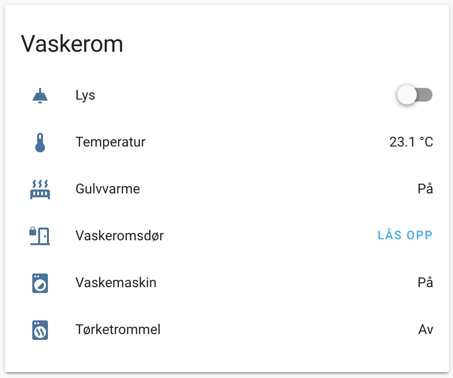
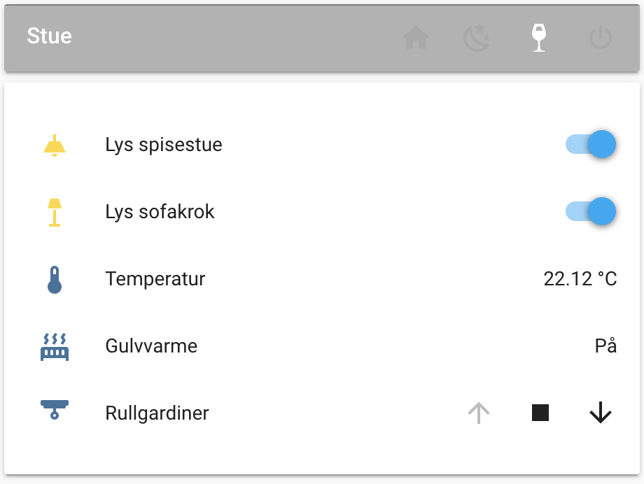
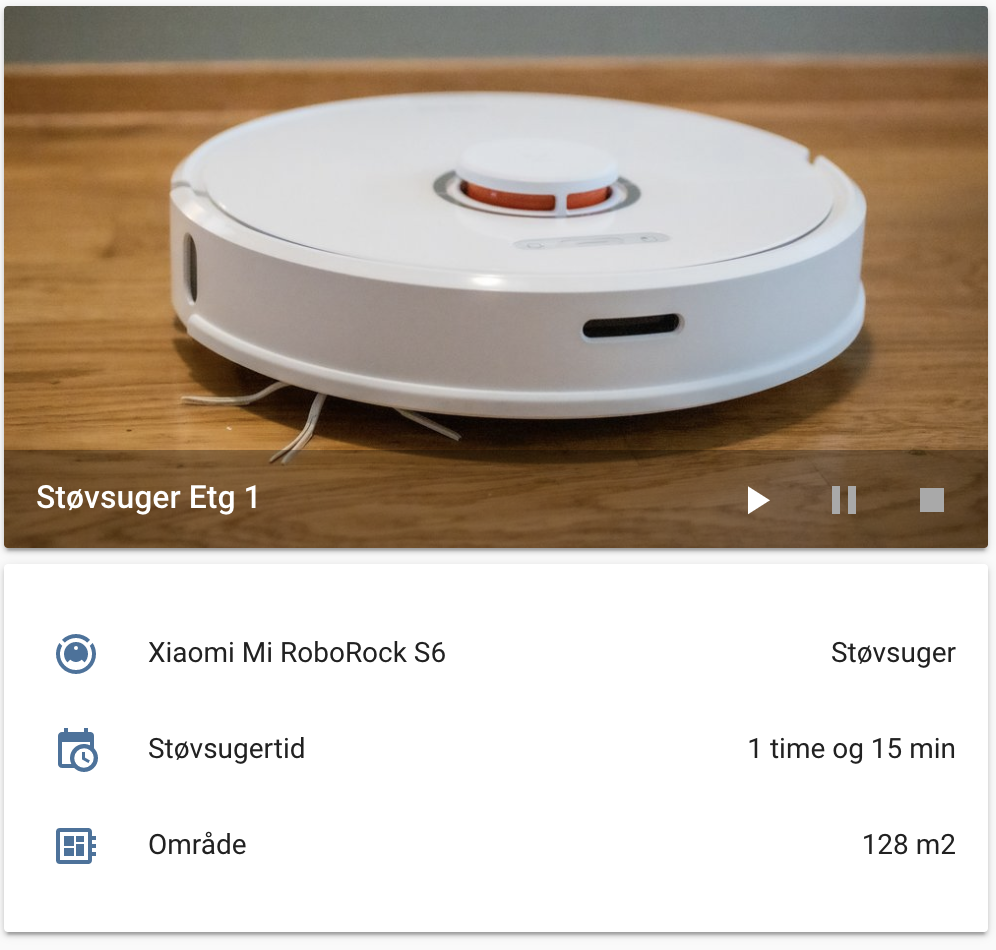
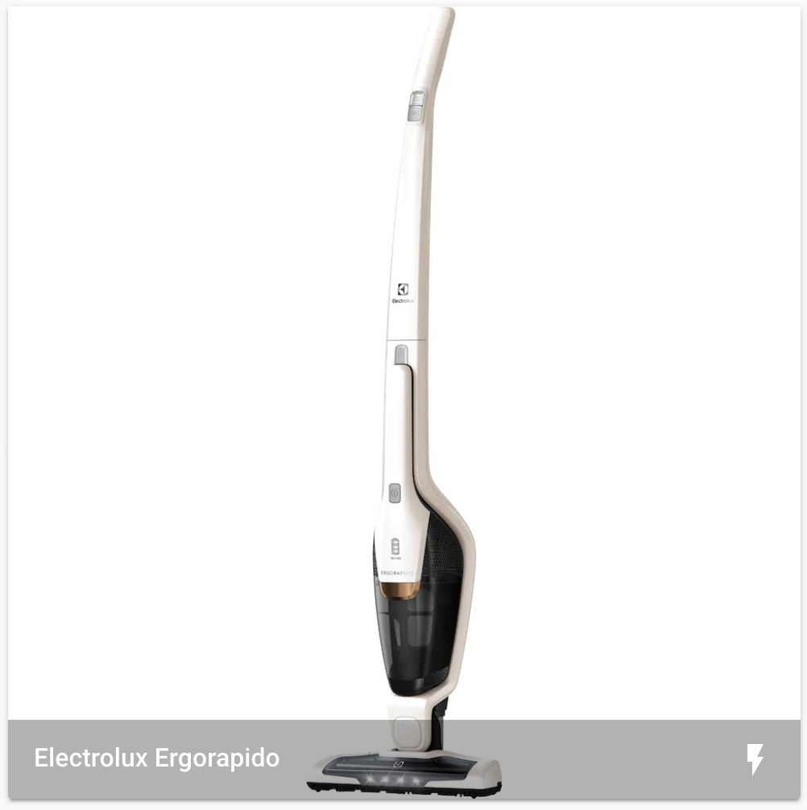

# home-assistant-demo
Demooppsett av home-assistant

## Kjøre demo
1. Kjør docker-compose.yml
2. Gå til localhost:8123
3. Følg veileder

## Eksempler
### Kort for vaskerom 

### Kort for stue med aktiv stemning

### Kort for robotstøvsuger

### Kort for å vise om støvsuger lader/ikke lader
